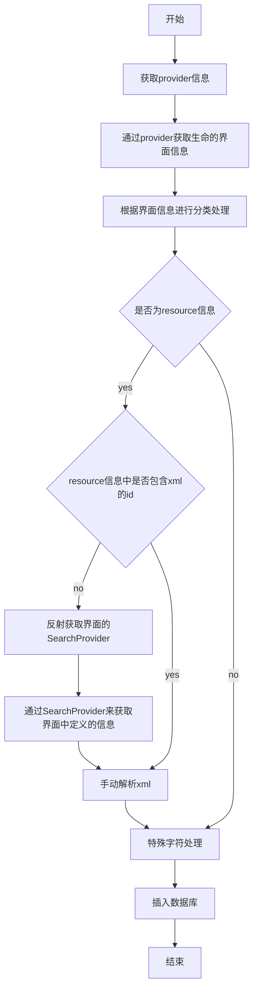

# Settings搜索分析

## 前言

本文基于Android N源码进行分析,其实Settings的数据库不仅能够搜索Settings下的项,它还可以搜索其它应用的
一些信息,例如短信和通讯录,理论上都是可以实现的。

## 涉及到的类

- com.android.settings.search.Index.java
- com.android.settings.DisplaySettings.java
- com.android.settings.SettingsSearchIndexablesProvider.java
- com.android.settings.search.SearchIndexableRaw.java
- com.android.settings.search.SearchIndexableResources.java
- android.provider.SearchIndexableResource.java
- android.provider.SearchIndexableData.java
- android.provider.SearchIndexablesProvider.java

## 数据库

Settings里面的搜索框架是基于数据库来实现的,数据库的名称叫search_index.db ,Android M是
在/data/data/com.android.settings/databases/下,Android N+是
在/data/user_de/0/com.android.settings/databases/下,如果不清楚的可按照下面的步骤进行查询

``` bash
adb shell
find . "search_index.db"
```

## 类图


## 插入数据

### 流程图



### 声明数据

声明数据的意思就是表明哪些界面的数据是可以被搜索的,例如在Settings中,SearchIndexableResources就声明
了许多可以搜索的界面,Wifi、显示、应用管理等。

``` java
//SearchIndexableResources.java
//声明显示是可以搜索的
sResMap.put(DisplaySettings.class.getName(),
            new SearchIndexableResource(
                Ranking.getRankForClassName(DisplaySettings.class.getName()),
                NO_DATA_RES_ID,
                DisplaySettings.class.getName(),
                R.drawable.ic_settings_display));
```

### 创建Provider

Settings的数据库的来源是ContentProvider,所以创建一个应用内部的ContentProvider,继承自
SearchIndexablesProvider,来进行提供数据,例如下面是Settings提供数据的。

``` java
    @Override
    public Cursor queryXmlResources(String[] projection) {
        MatrixCursor cursor = new MatrixCursor(INDEXABLES_XML_RES_COLUMNS);
        final List<SearchIndexableResource> resources =
                getSearchIndexableResourcesFromProvider(getContext());
        for (SearchIndexableResource val : resources) {
            Object[] ref = new Object[INDEXABLES_XML_RES_COLUMNS.length];
            ref[COLUMN_INDEX_XML_RES_RANK] = val.rank;
            ref[COLUMN_INDEX_XML_RES_RESID] = val.xmlResId;
            ref[COLUMN_INDEX_XML_RES_CLASS_NAME] = val.className;
            ref[COLUMN_INDEX_XML_RES_ICON_RESID] = val.iconResId;
            ref[COLUMN_INDEX_XML_RES_INTENT_ACTION] = val.intentAction;
            ref[COLUMN_INDEX_XML_RES_INTENT_TARGET_PACKAGE] = val.intentTargetPackage;
            ref[COLUMN_INDEX_XML_RES_INTENT_TARGET_CLASS] = null; // intent target class
            cursor.addRow(ref);
        }

        return cursor;
    }

    @Override
    public Cursor queryRawData(String[] projection) {
        MatrixCursor cursor = new MatrixCursor(INDEXABLES_RAW_COLUMNS);
        final List<SearchIndexableRaw> raws = getSearchIndexableRawFromProvider(getContext());
        for (SearchIndexableRaw val : raws) {
            Object[] ref = new Object[INDEXABLES_RAW_COLUMNS.length];
            ref[COLUMN_INDEX_RAW_TITLE] = val.title;
            ref[COLUMN_INDEX_RAW_SUMMARY_ON] = val.summaryOn;
            ref[COLUMN_INDEX_RAW_SUMMARY_OFF] = val.summaryOff;
            ref[COLUMN_INDEX_RAW_ENTRIES] = val.entries;
            ref[COLUMN_INDEX_RAW_KEYWORDS] = val.keywords;
            ref[COLUMN_INDEX_RAW_SCREEN_TITLE] = val.screenTitle;
            ref[COLUMN_INDEX_RAW_CLASS_NAME] = val.className;
            ref[COLUMN_INDEX_RAW_ICON_RESID] = val.iconResId;
            ref[COLUMN_INDEX_RAW_INTENT_ACTION] = val.intentAction;
            ref[COLUMN_INDEX_RAW_INTENT_TARGET_PACKAGE] = val.intentTargetPackage;
            ref[COLUMN_INDEX_RAW_INTENT_TARGET_CLASS] = val.intentTargetClass;
            ref[COLUMN_INDEX_RAW_KEY] = val.key;
            ref[COLUMN_INDEX_RAW_USER_ID] = val.userId;
            cursor.addRow(ref);
        }

        return cursor;
    }

    /**
     * Gets a combined list non-indexable keys that come from providers inside of settings.
     * The non-indexable keys are used in Settings search at both index and update time to verify
     * the validity of results in the database.
     */
    @Override
    public Cursor queryNonIndexableKeys(String[] projection) {
        MatrixCursor cursor = new MatrixCursor(NON_INDEXABLES_KEYS_COLUMNS);
        final List<String> nonIndexableKeys = getNonIndexableKeysFromProvider(getContext());
        for (String nik : nonIndexableKeys) {
            final Object[] ref = new Object[NON_INDEXABLES_KEYS_COLUMNS.length];
            ref[COLUMN_INDEX_NON_INDEXABLE_KEYS_KEY_VALUE] = nik;
            cursor.addRow(ref);
        }

        return cursor;
    }

    @Override
    public Cursor querySiteMapPairs() {
        final MatrixCursor cursor = new MatrixCursor(SITE_MAP_COLUMNS);
        final Context context = getContext();
        // Loop through all IA categories and pages and build additional SiteMapPairs
        final List<DashboardCategory> categories = FeatureFactory.getFactory(context)
                .getDashboardFeatureProvider(context).getAllCategories();
        for (DashboardCategory category : categories) {
            // Use the category key to look up parent (which page hosts this key)
            final String parentClass = CATEGORY_KEY_TO_PARENT_MAP.get(category.key);
            if (parentClass == null) {
                continue;
            }
            // Build parent-child class pairs for all children listed under this key.
            for (Tile tile : category.getTiles()) {
                String childClass = null;
                if (tile.metaData != null) {
                    childClass = tile.metaData.getString(
                            SettingsActivity.META_DATA_KEY_FRAGMENT_CLASS);
                }
                if (childClass == null) {
                    continue;
                }
                cursor.newRow()
                        .add(SearchIndexablesContract.SiteMapColumns.PARENT_CLASS, parentClass)
                        .add(SearchIndexablesContract.SiteMapColumns.CHILD_CLASS, childClass);
            }
        }
        // Done.
        return cursor;
    }
```

### 获取真实的数据

提供数据的是各个具体的页面,DisplaySettings.java

``` java
    public static final Indexable.SearchIndexProvider SEARCH_INDEX_DATA_PROVIDER =
            new BaseSearchIndexProvider() {
//从xml中获取数据,到时会解析xml
                @Override
                public List<SearchIndexableResource> getXmlResourcesToIndex(Context context,
                        boolean enabled) {
                    final ArrayList<SearchIndexableResource> result = new ArrayList<>();

                    final SearchIndexableResource sir = new SearchIndexableResource(context);
                    sir.xmlResId = R.xml.display_settings;
                    result.add(sir);
                    return result;
                }
//获取不加入搜索的数据
                @Override
                public List<String> getNonIndexableKeys(Context context) {
                    List<String> keys = super.getNonIndexableKeys(context);
                    keys.add(KEY_DISPLAY_SIZE);
                    keys.add(WallpaperPreferenceController.KEY_WALLPAPER);
                    keys.add(KEY_NIGHT_DISPLAY);
                    keys.add(KEY_AUTO_BRIGHTNESS);
                    return keys;
                }

                @Override
                public List<AbstractPreferenceController> createPreferenceControllers(
                        Context context) {
                    return buildPreferenceControllers(context, null);
                }
            };
```

动态更新数据

在SettingsActivity的onResume()中，调用updateDeviceIndex()

``` java
private void updateDeviceIndex() {
    DeviceIndexFeatureProvider indexProvider = FeatureFactory.getFactory(
        this).getDeviceIndexFeatureProvider();
    
    ThreadUtils.postOnBackgroundThread(
        () -> indexProvider.updateIndex(SettingsActivity.this, false /* force */));
}
```

DeviceIndexFeatureProvider中，使用JobScheduler设定更新任务

``` java
    default void updateIndex(Context context, boolean force) {
        if (!isIndexingEnabled()) {
            Log.i(TAG, "Skipping: device index is not enabled");
            return;
        }

        if (!Utils.isDeviceProvisioned(context)) {
            Log.w(TAG, "Skipping: device is not provisioned");
            return;
        }

        final ComponentName jobComponent = new ComponentName(context.getPackageName(),
                DeviceIndexUpdateJobService.class.getName());

        try {
            final int callerUid = Binder.getCallingUid();
            final ServiceInfo si = context.getPackageManager().getServiceInfo(jobComponent,
                    PackageManager.MATCH_DIRECT_BOOT_AWARE
                            | PackageManager.MATCH_DIRECT_BOOT_UNAWARE);
            if (si == null) {
                Log.w(TAG, "Skipping: No such service " + jobComponent);
                return;
            }
            if (si.applicationInfo.uid != callerUid) {
                Log.w(TAG, "Skipping: Uid cannot schedule DeviceIndexUpdate: " + callerUid);
                return;
            }
        } catch (PackageManager.NameNotFoundException e) {
            Log.w(TAG, "Skipping: error finding DeviceIndexUpdateJobService from packageManager");
            return;
        }

        if (!force && skipIndex(context)) {
            Log.i(TAG, "Skipping: already indexed.");
            // No need to update.
            return;
        }

        // Prevent scheduling multiple jobs
        setIndexState(context);

        final int jobId = context.getResources().getInteger(R.integer.device_index_update);
        // Schedule a job so that we know it'll be able to complete, but try to run as
        // soon as possible.
        context.getSystemService(JobScheduler.class).schedule(
                new JobInfo.Builder(jobId, jobComponent)
                        .setPersisted(true)
                        .setMinimumLatency(1000)
                        .setOverrideDeadline(1)
                        .build());

    }
```

DeviceIndexUpdateJobService

``` java
    protected void updateIndex(JobParameters params) {
        if (DEBUG) {
            Log.d(TAG, "Starting index");
        }
        final DeviceIndexFeatureProvider indexProvider = FeatureFactory.getFactory(this)
                .getDeviceIndexFeatureProvider();
        final SliceViewManager manager = getSliceViewManager();
        final Uri baseUri = new Builder()
                .scheme(ContentResolver.SCHEME_CONTENT)
                .authority(SettingsSliceProvider.SLICE_AUTHORITY)
                .build();
        final Uri platformBaseUri = new Builder()
                .scheme(ContentResolver.SCHEME_CONTENT)
                .authority(SettingsSlicesContract.AUTHORITY)
                .build();
        final Collection<Uri> slices = manager.getSliceDescendants(baseUri);
        slices.addAll(manager.getSliceDescendants(platformBaseUri));

        if (DEBUG) {
            Log.d(TAG, "Indexing " + slices.size() + " slices");
        }

        indexProvider.clearIndex(this /* context */);

        for (Uri slice : slices) {
            if (!mRunningJob) {
                return;
            }
            Slice loadedSlice = bindSliceSynchronous(manager, slice);
            // TODO: Get Title APIs on SliceMetadata and use that.
            SliceMetadata metaData = getMetadata(loadedSlice);
            CharSequence title = findTitle(loadedSlice, metaData);
            if (title != null) {
                if (DEBUG) {
                    Log.d(TAG, "Indexing: " + slice + " " + title + " " + loadedSlice);
                }
                //这里调用index，然而，实际上这里并没有真正有效的工作，有效的工作是在SearchToolbar出现之后的index。
                indexProvider.index(this, title, slice, createDeepLink(
                        new Intent(SliceDeepLinkSpringBoard.ACTION_VIEW_SLICE)
                                .setPackage(getPackageName())
                                .putExtra(SliceDeepLinkSpringBoard.EXTRA_SLICE, slice.toString())
                                .toUri(Intent.URI_ANDROID_APP_SCHEME)),
                        metaData.getSliceKeywords());
            }
        }
        if (DEBUG) {
            Log.d(TAG, "Done indexing");
        }
        jobFinished(params, false);
    }
```

### SearchToolbar

init SearchToolbar

```java
//SearchFeatureProvider.java
default void initSearchToolbar(Activity activity, Toolbar toolbar) {
    if (activity == null || toolbar == null) {
        return;
    }
    toolbar.setOnClickListener(tb -> {
        final Intent intent = SEARCH_UI_INTENT;
        intent.setPackage(getSettingsIntelligencePkgName());

        FeatureFactory.getFactory(
                activity.getApplicationContext()).getSlicesFeatureProvider()
                .indexSliceDataAsync(activity.getApplicationContext());
        activity.startActivityForResult(intent, 0 /* requestCode */);
    });
}
```
SlicesFeatureProvider的实现SlicesFeatureProviderImpl

```java
//SlicesFeatureProviderImpl.java
@Override
public void indexSliceDataAsync(Context context) {
    SlicesIndexer indexer = getSliceIndexer(context);
    ThreadUtils.postOnBackgroundThread(indexer);
}
```
SlicesIndexer实现了Runable接口，run()函数调用indexSliceData()

```java
//SliceIndexer.java
protected void indexSliceData() {
    if (mHelper.isSliceDataIndexed()) {
        Log.d(TAG, "Slices already indexed - returning.");
        return;
    }

    SQLiteDatabase database = mHelper.getWritableDatabase();

    try {
        long startTime = System.currentTimeMillis();
        database.beginTransaction();

        mHelper.reconstruct(mHelper.getWritableDatabase());
        List<SliceData> indexData = getSliceData();
        insertSliceData(database, indexData);

        mHelper.setIndexedState();

        // TODO (b/71503044) Log indexing time.
        Log.d(TAG,
                "Indexing slices database took: " + (System.currentTimeMillis() - startTime));
        database.setTransactionSuccessful();
    } finally {
        database.endTransaction();
    }
}
@VisibleForTesting
List<SliceData> getSliceData() {
    return FeatureFactory.getFactory(mContext)
        .getSlicesFeatureProvider()
        .getSliceDataConverter(mContext)
        .getSliceData();
}

@VisibleForTesting
void insertSliceData(SQLiteDatabase database, List<SliceData> indexData) {
    ContentValues values;
    
    for (SliceData dataRow : indexData) {
        values = new ContentValues();
        values.put(IndexColumns.KEY, dataRow.getKey());
        values.put(IndexColumns.TITLE, dataRow.getTitle());
        values.put(IndexColumns.SUMMARY, dataRow.getSummary());
        values.put(IndexColumns.SCREENTITLE, dataRow.getScreenTitle().toString());
        values.put(IndexColumns.KEYWORDS, dataRow.getKeywords());
        values.put(IndexColumns.ICON_RESOURCE, dataRow.getIconResource());
        values.put(IndexColumns.FRAGMENT, dataRow.getFragmentClassName());
        values.put(IndexColumns.CONTROLLER, dataRow.getPreferenceController());
        values.put(IndexColumns.PLATFORM_SLICE, dataRow.isPlatformDefined());
        values.put(IndexColumns.SLICE_TYPE, dataRow.getSliceType());
        
        database.replaceOrThrow(Tables.TABLE_SLICES_INDEX, null /* nullColumnHack */,
                                values);
    }
}
```
上面getSliceData比较复杂，具体路径见下

``` java
    //SliceDataConverter.java
    public List<SliceData> getSliceData() {
        if (!mSliceData.isEmpty()) {
            return mSliceData;
        }

        final Collection<Class> indexableClasses = FeatureFactory.getFactory(mContext)
                .getSearchFeatureProvider().getSearchIndexableResources().getProviderValues();

        for (Class clazz : indexableClasses) {
            final String fragmentName = clazz.getName();

            final SearchIndexProvider provider = DatabaseIndexingUtils.getSearchIndexProvider(
                    clazz);

            // CodeInspection test guards against the null check. Keep check in case of bad actors.
            if (provider == null) {
                Log.e(TAG, fragmentName + " dose not implement Search Index Provider");
                continue;
            }

            final List<SliceData> providerSliceData = getSliceDataFromProvider(provider,
                    fragmentName);
            mSliceData.addAll(providerSliceData);
        }

        final List<SliceData> a11ySliceData = getAccessibilitySliceData();
        mSliceData.addAll(a11ySliceData);
        return mSliceData;
    }
```

其中获取Provider数据的是

``` java
    private List<SliceData> getSliceDataFromProvider(SearchIndexProvider provider,
            String fragmentName) {
        final List<SliceData> sliceData = new ArrayList<>();

        final List<SearchIndexableResource> resList =
                provider.getXmlResourcesToIndex(mContext, true /* enabled */);

        if (resList == null) {
            return sliceData;
        }

        // TODO (b/67996923) get a list of permanent NIKs and skip the invalid keys.

        for (SearchIndexableResource resource : resList) {
            int xmlResId = resource.xmlResId;
            if (xmlResId == 0) {
                Log.e(TAG, fragmentName + " provides invalid XML (0) in search provider.");
                continue;
            }

            List<SliceData> xmlSliceData = getSliceDataFromXML(xmlResId, fragmentName);
            sliceData.addAll(xmlSliceData);
        }

        return sliceData;
    }

    private List<SliceData> getSliceDataFromXML(int xmlResId, String fragmentName) {
        XmlResourceParser parser = null;

        final List<SliceData> xmlSliceData = new ArrayList<>();

        try {
            parser = mContext.getResources().getXml(xmlResId);

            int type;
            while ((type = parser.next()) != XmlPullParser.END_DOCUMENT
                    && type != XmlPullParser.START_TAG) {
                // Parse next until start tag is found
            }

            String nodeName = parser.getName();
            if (!NODE_NAME_PREFERENCE_SCREEN.equals(nodeName)) {
                throw new RuntimeException(
                        "XML document must start with <PreferenceScreen> tag; found"
                                + nodeName + " at " + parser.getPositionDescription());
            }

            final AttributeSet attrs = Xml.asAttributeSet(parser);
            final String screenTitle = PreferenceXmlParserUtils.getDataTitle(mContext, attrs);

            // TODO (b/67996923) Investigate if we need headers for Slices, since they never
            // correspond to an actual setting.

            final List<Bundle> metadata = PreferenceXmlParserUtils.extractMetadata(mContext,
                    xmlResId,
                    MetadataFlag.FLAG_NEED_KEY
                            | MetadataFlag.FLAG_NEED_PREF_CONTROLLER
                            | MetadataFlag.FLAG_NEED_PREF_TYPE
                            | MetadataFlag.FLAG_NEED_PREF_TITLE
                            | MetadataFlag.FLAG_NEED_PREF_ICON
                            | MetadataFlag.FLAG_NEED_PREF_SUMMARY
                            | MetadataFlag.FLAG_NEED_PLATFORM_SLICE_FLAG);

            for (Bundle bundle : metadata) {
                // TODO (b/67996923) Non-controller Slices should become intent-only slices.
                // Note that without a controller, dynamic summaries are impossible.
                final String controllerClassName = bundle.getString(METADATA_CONTROLLER);
                if (TextUtils.isEmpty(controllerClassName)) {
                    continue;
                }

                final String key = bundle.getString(METADATA_KEY);
                final String title = bundle.getString(METADATA_TITLE);
                final String summary = bundle.getString(METADATA_SUMMARY);
                final int iconResId = bundle.getInt(METADATA_ICON);
                final int sliceType = SliceBuilderUtils.getSliceType(mContext, controllerClassName,
                        key);
                final boolean isPlatformSlice = bundle.getBoolean(METADATA_PLATFORM_SLICE_FLAG);

                final SliceData xmlSlice = new SliceData.Builder()
                        .setKey(key)
                        .setTitle(title)
                        .setSummary(summary)
                        .setIcon(iconResId)
                        .setScreenTitle(screenTitle)
                        .setPreferenceControllerClassName(controllerClassName)
                        .setFragmentName(fragmentName)
                        .setSliceType(sliceType)
                        .setPlatformDefined(isPlatformSlice)
                        .build();

                final BasePreferenceController controller =
                        SliceBuilderUtils.getPreferenceController(mContext, xmlSlice);

                // Only add pre-approved Slices available on the device.
                if (controller.isAvailable() && controller.isSliceable()) {
                    xmlSliceData.add(xmlSlice);
                }
            }
        } catch (SliceData.InvalidSliceDataException e) {
            Log.w(TAG, "Invalid data when building SliceData for " + fragmentName, e);
        } catch (XmlPullParserException e) {
            Log.w(TAG, "XML Error parsing PreferenceScreen: ", e);
        } catch (IOException e) {
            Log.w(TAG, "IO Error parsing PreferenceScreen: ", e);
        } catch (Resources.NotFoundException e) {
            Log.w(TAG, "Resource not found error parsing PreferenceScreen: ", e);
        } finally {
            if (parser != null) parser.close();
        }
        return xmlSliceData;
    }
```

获取Accessibility的数据

``` java
    private List<SliceData> getAccessibilitySliceData() {
        final List<SliceData> sliceData = new ArrayList<>();

        final String accessibilityControllerClassName =
                AccessibilitySlicePreferenceController.class.getName();
        final String fragmentClassName = AccessibilitySettings.class.getName();
        final CharSequence screenTitle = mContext.getText(R.string.accessibility_settings);

        final SliceData.Builder sliceDataBuilder = new SliceData.Builder()
                .setFragmentName(fragmentClassName)
                .setScreenTitle(screenTitle)
                .setPreferenceControllerClassName(accessibilityControllerClassName);

        final Set<String> a11yServiceNames = new HashSet<>();
        Collections.addAll(a11yServiceNames, mContext.getResources()
                .getStringArray(R.array.config_settings_slices_accessibility_components));
        final List<AccessibilityServiceInfo> installedServices = getAccessibilityServiceInfoList();
        final PackageManager packageManager = mContext.getPackageManager();

        for (AccessibilityServiceInfo a11yServiceInfo : installedServices) {
            final ResolveInfo resolveInfo = a11yServiceInfo.getResolveInfo();
            final ServiceInfo serviceInfo = resolveInfo.serviceInfo;
            final String packageName = serviceInfo.packageName;
            final ComponentName componentName = new ComponentName(packageName, serviceInfo.name);
            final String flattenedName = componentName.flattenToString();

            if (!a11yServiceNames.contains(flattenedName)) {
                continue;
            }

            final String title = resolveInfo.loadLabel(packageManager).toString();
            int iconResource = resolveInfo.getIconResource();
            if (iconResource == 0) {
                iconResource = R.mipmap.ic_accessibility_generic;
            }

            sliceDataBuilder.setKey(flattenedName)
                    .setTitle(title)
                    .setIcon(iconResource)
                    .setSliceType(SliceData.SliceType.SWITCH);
            try {
                sliceData.add(sliceDataBuilder.build());
            } catch (SliceData.InvalidSliceDataException e) {
                Log.w(TAG, "Invalid data when building a11y SliceData for " + flattenedName, e);
            }
        }

        return sliceData;
    }

    @VisibleForTesting
    List<AccessibilityServiceInfo> getAccessibilityServiceInfoList() {
        final AccessibilityManager accessibilityManager = AccessibilityManager.getInstance(
                mContext);
        return accessibilityManager.getInstalledAccessibilityServiceList();
    }
```

数据索引到此基本建立完成。

## 查找数据


``` sql
SELECT data_rank, data_title, data_summary_on, data_summary_off, data_entries, data_keywords,
class_name, screen_title, icon, intent_action, intent_target_package, intent_target_class, enabled,
data_key_reference FROM prefs_index WHERE prefs_index MATCH 'data_title:w* OR data_title_normalized:w*
OR data_keywords:w*' AND locale = 'zh_CN_#Hans' AND enabled = 1 ORDER BY data_rank
/* Search secondary query:*/
SELECT data_rank, data_title, data_summary_on, data_summary_off, data_entries,
data_keywords, class_name, screen_title, icon, intent_action, intent_target_package, intent_target_class,
enabled, data_key_reference FROM prefs_index WHERE prefs_index MATCH 'data_summary_on:w* OR
data_summary_on_normalized:w* OR data_summary_off:w* OR data_summary_off_normalized:w* OR
data_entries:w' AND locale = 'zh_CN_#Hans' AND enabled = 1 EXCEPT SELECT data_rank, data_title,
data_summary_on, data_summary_off, data_entries, data_keywords, class_name, screen_title, icon, intent_action,
intent_target_package, intent_target_class, enabled, data_key_reference FROM prefs_index WHERE prefs_index
MATCH 'data_title:w OR data_title_normalized:w* OR data_keywords:w*' AND locale = 'zh_CN_#Hans' AND
enabled = 1 ORDER BY data_rank
```

将两个结果进行合并