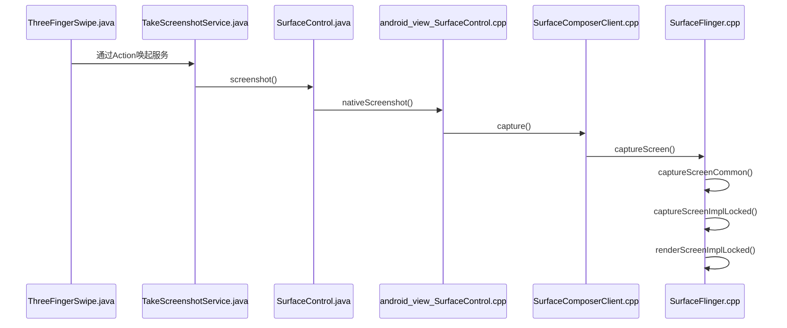

# 截屏代码分析

## 时序图



## ThreeFingerSwipe.java

 (frameworks\base\packages\systemui\src\com\android\systemui\statusbar\phone)

无论是Android自带的按键截屏还是三指截屏，入口是类似的

``` java
private static final String PACK_NAME = "com.ape.screenshot";
private static final String CLASS_NAME = "com.ape.screenshot.TakeScreenshotService";
private void takeScreenshot() {
    try {
        Intent screenshotIntent = new Intent();
        screenshotIntent.setComponent(new ComponentName(PACK_NAME,CLASS_NAME));
        screenshotIntent.setAction(THREE_FINGER_SWIPE_ACTION);
        mContext.startService(screenshotIntent);
    } catch (Exception e) {
        log("ServiceNotFoundException... e = " + e)
    }
}
```

## TakeScreenshotService.java

(ApeScreenshot app)

在启动截屏APP的Service之后，Service根据Android版本处理，Android P及以上采用反射调用SurfaceControl的截屏接口。否则直接调用ScreenshotHelper的截屏接口。

``` java
if (Build.VERSION.SDK_INT >= Build.VERSION_CODES.P) {
    try{
        Class cls = Class.forName("android.view.SurfaceControl");
        Method screenshot = cls.getMethod("screenshot", Class.forName("android.graphics.Rect"), int.class, int.class, int.class);
        screenshot.setAccessible(true);
        Bitmap source = (Bitmap) screenshot.invoke(null, new Rect(), (int) dims[0], (int) dims[1], mRotation);
        mScreenBitmap = source.copy(Bitmap.Config.ARGB_8888, true);
        source.recycle();
    } catch (Exception e) {
        e.printStackTrace();
    }
    if (mScreenBitmap == null) {
        notifyScreenshotError(mContext, mNotificationManager);
        callback.onCaptureFinish(false, false);
        return;
    }
} else {
    if (requiresRotation) {
        // Get the dimensions of the device in its native orientation
        mDisplayMatrix.reset();
        mDisplayMatrix.preRotate(-degrees);
        mDisplayMatrix.mapPoints(dims);
        dims[0] = Math.abs(dims[0]);
        dims[1] = Math.abs(dims[1]);
    }
    mScreenBitmap = ScreenshotHelper.screenshot((int) dims[0], (int) dims[1]);
    if (mScreenBitmap == null) {
        notifyScreenshotError(mContext, mNotificationManager);
        callback.onCaptureFinish(false, false);
        return;
    }
    if (requiresRotation) {
        // Rotate the screenshot to the current orientation
        Bitmap ss = Bitmap.createBitmap(mDisplayMetrics.widthPixels,                                        mDisplayMetrics.heightPixels, Bitmap.Config.ARGB_8888);
        Canvas c = new Canvas(ss);
        c.translate(ss.getWidth() / 2, ss.getHeight() / 2);
        c.rotate(degrees);
        c.translate(-dims[0] / 2, -dims[1] / 2);
        c.drawBitmap(mScreenBitmap, 0, 0, null);
        c.setBitmap(null);
        // Recycle the previous bitmap
        mScreenBitmap.recycle();
        mScreenBitmap = ss;
    }
}
```

此处之后分析Android P及以上过程。

## SurfaceControl.java

(frameworks\base\core\java\android\view)

通过JNI的方式调用native截屏接口

``` java
 public static Bitmap screenshot(Rect sourceCrop, int width, int height, int rotation) {
    //TINNO BEGIN
    //Add by Ben.Hsu for screenshot exclude cutout area, PDBBW-1038
    if (JourneyCustomFeature.SOLVE_CUTOUT_MODE_BUG) {
        if (sourceCrop != null && sourceCrop.isEmpty()) {
            //screenshot should exclude Letterbox width
            TdfSlog.d(TAG, "displayCutout " + DisplayCutout.mSafeInsetsExt);
            switch (rotation) {
                case ROTATION_90:
                    sourceCrop.set(DisplayCutout.mSafeInsetsExt.left, 0, width, height);
                    break;
                case ROTATION_270:
                    sourceCrop.set(DisplayCutout.mSafeInsetsExt.right, 0, width, height);
                    break;
                default:
                    sourceCrop.set(0, 0, width, height);
                    break;
                }
            }
        }
        //TINNO END

        // TODO: should take the display as a parameter
        IBinder displayToken = SurfaceControl.getBuiltInDisplay(
                SurfaceControl.BUILT_IN_DISPLAY_ID_MAIN);
        if (rotation == ROTATION_90 || rotation == ROTATION_270) {
            rotation = (rotation == ROTATION_90) ? ROTATION_270 : ROTATION_90;
        }

        SurfaceControl.rotateCropForSF(sourceCrop, rotation);
        return nativeScreenshot(displayToken, sourceCrop, width, height, 0, 0, true,
                false, rotation);
    }
```

```java
private static native Bitmap nativeScreenshot(IBinder displayToken,
            Rect sourceCrop, int width, int height, int minLayer, int maxLayer,
            boolean allLayers, boolean useIdentityTransform, int rotation);
```

## android_view_SurfaceControl.cpp

(frameworks\base\core\jni)

``` c++
static const JNINativeMethod sSurfaceControlMethods[] = {
    ...
    {"nativeScreenshot", "(Landroid/os/IBinder;Landroid/graphics/Rect;IIIIZZI)Landroid/graphics/Bitmap;",
            (void*)nativeScreenshotBitmap },
    ...
}
```

``` C++
static jobject nativeScreenshotBitmap(JNIEnv* env, jclass clazz,
        jobject displayTokenObj, jobject sourceCropObj, jint width, jint height,
        jint minLayer, jint maxLayer, bool allLayers, bool useIdentityTransform,
        int rotation) {
    sp<IBinder> displayToken = ibinderForJavaObject(env, displayTokenObj);
    if (displayToken == NULL) {
        return NULL;
    }

    Rect sourceCrop = rectFromObj(env, sourceCropObj);

    std::unique_ptr<ScreenshotClient> screenshot(new ScreenshotClient());
    status_t res;
    if (allLayers) {
        minLayer = INT32_MIN;
        maxLayer = INT32_MAX;
    }
    //截图的地方！！-----------------------------
    sp<GraphicBuffer> buffer;
    res = ScreenshotClient::capture(displayToken, sourceCrop, width, height,
        minLayer, maxLayer, useIdentityTransform, static_cast<uint32_t>(rotation), &buffer);
    //截图的地方！！-----------------------------
    if (res != NO_ERROR) {
        return NULL;
    }

    SkColorType colorType;
    SkAlphaType alphaType;

    PixelFormat format = buffer->getPixelFormat();
    switch (format) {
        case PIXEL_FORMAT_RGBX_8888: {
            colorType = kRGBA_8888_SkColorType;
            alphaType = kOpaque_SkAlphaType;
            break;
        }
        case PIXEL_FORMAT_RGBA_8888: {
            colorType = kRGBA_8888_SkColorType;
            alphaType = kPremul_SkAlphaType;
            break;
        }
        case PIXEL_FORMAT_RGBA_FP16: {
            colorType = kRGBA_F16_SkColorType;
            alphaType = kPremul_SkAlphaType;
            break;
        }
        case PIXEL_FORMAT_RGB_565: {
            colorType = kRGB_565_SkColorType;
            alphaType = kOpaque_SkAlphaType;
            break;
        }
        default: {
            return NULL;
        }
    }

    SkImageInfo info = SkImageInfo::Make(buffer->getWidth(), buffer->getHeight(),
                                         colorType, alphaType,
                                         SkColorSpace::MakeSRGB());

    //通过拿到的GraphicBuffer创建bitmap
    auto bitmap = sk_sp<Bitmap>(new Bitmap(buffer.get(), info));
    return bitmap::createBitmap(env, bitmap.release(),
                                android::bitmap::kBitmapCreateFlag_Premultiplied, NULL);
}
```

## SurfaceComposerClient.cpp

(frameworks\native\libs\gui)

通过远程调用Service的截屏接口

``` c++
status_t ScreenshotClient::capture(const sp<IBinder>& display, Rect sourceCrop, uint32_t reqWidth,
                                   uint32_t reqHeight, int32_t minLayerZ, int32_t maxLayerZ,
                                   bool useIdentityTransform, uint32_t rotation,
                                   sp<GraphicBuffer>* outBuffer) {
    sp<ISurfaceComposer> s(ComposerService::getComposerService());
    if (s == NULL) return NO_INIT;
    //截图的地方！！-----------------------------
    status_t ret = s->captureScreen(display, outBuffer, sourceCrop, reqWidth, reqHeight, minLayerZ,
                                    maxLayerZ, useIdentityTransform,
                                    static_cast<ISurfaceComposer::Rotation>(rotation));
    //截图的地方！！-----------------------------
    if (ret != NO_ERROR) {
        return ret;
    }
    return ret;
}
```

## SurfaceFlinger.cpp

(frameworks\native\services\surfaceflinger)

``` c++
status_t SurfaceFlinger::captureScreen(const sp<IBinder>& display, sp<GraphicBuffer>* outBuffer,
                                       Rect sourceCrop, uint32_t reqWidth, uint32_t reqHeight,
                                       int32_t minLayerZ, int32_t maxLayerZ,
                                       bool useIdentityTransform,
                                       ISurfaceComposer::Rotation rotation) {
    ATRACE_CALL();

    if (CC_UNLIKELY(display == 0)) return BAD_VALUE;

    const sp<const DisplayDevice> device(getDisplayDeviceLocked(display));
    if (CC_UNLIKELY(device == 0)) return BAD_VALUE;

    DisplayRenderArea renderArea(device, sourceCrop, reqHeight, reqWidth, rotation);

//TINNO BEGIN
//Add by Ben.Hsu for screenshot exclude screen corner, PDBBW-1038
#ifdef JCF_SCREEN_CAPTURE_EXCLUDE_SCREEN_CORNER
    bool screenshotMode = false;
    if (sourceCrop.width() != 0 && sourceCrop.height() != 0) {
        screenshotMode = true;
    }
    auto traverseLayers = std::bind(std::mem_fn(&SurfaceFlinger::traverseLayersInDisplayExt), this,
                                    device, minLayerZ, maxLayerZ, std::placeholders::_1, screenshotMode);
#else
    auto traverseLayers = std::bind(std::mem_fn(&SurfaceFlinger::traverseLayersInDisplay), this,
                                    device, minLayerZ, maxLayerZ, std::placeholders::_1);
#endif
//TINNO END

    return captureScreenCommon(renderArea, traverseLayers, outBuffer, useIdentityTransform);
}
```

``` c++
status_t SurfaceFlinger::captureScreenCommon(RenderArea& renderArea,
                                             TraverseLayersFunction traverseLayers,
                                             sp<GraphicBuffer>* outBuffer,
                                             bool useIdentityTransform) {
    ATRACE_CALL();

    renderArea.updateDimensions(mPrimaryDisplayOrientation);

    const uint32_t usage = GRALLOC_USAGE_SW_READ_OFTEN | GRALLOC_USAGE_SW_WRITE_OFTEN |
            GRALLOC_USAGE_HW_RENDER | GRALLOC_USAGE_HW_TEXTURE;
    //此时实际上已经完成了截屏
    *outBuffer = new GraphicBuffer(renderArea.getReqWidth(), renderArea.getReqHeight(),
                                   HAL_PIXEL_FORMAT_RGBA_8888, 1, usage, "screenshot");

    // This mutex protects syncFd and captureResult for communication of the return values from the
    // main thread back to this Binder thread
    std::mutex captureMutex;
    std::condition_variable captureCondition;
    std::unique_lock<std::mutex> captureLock(captureMutex);
    int syncFd = -1;
    std::optional<status_t> captureResult;

    const int uid = IPCThreadState::self()->getCallingUid();
    const bool forSystem = uid == AID_GRAPHICS || uid == AID_SYSTEM;

    sp<LambdaMessage> message = new LambdaMessage([&]() {
        // If there is a refresh pending, bug out early and tell the binder thread to try again
        // after the refresh.
        if (mRefreshPending) {
            ATRACE_NAME("Skipping screenshot for now");
            std::unique_lock<std::mutex> captureLock(captureMutex);
            captureResult = std::make_optional<status_t>(EAGAIN);
            captureCondition.notify_one();
            return;
        }

        status_t result = NO_ERROR;
        int fd = -1;
        {
            Mutex::Autolock _l(mStateLock);
            renderArea.render([&]() {
                result = captureScreenImplLocked(renderArea, traverseLayers, (*outBuffer).get(),
                                                 useIdentityTransform, forSystem, &fd);
            });
        }

        {
            std::unique_lock<std::mutex> captureLock(captureMutex);
            syncFd = fd;
            captureResult = std::make_optional<status_t>(result);
            captureCondition.notify_one();
        }
    });

    status_t result = postMessageAsync(message);
    if (result == NO_ERROR) {
        captureCondition.wait(captureLock, [&]() { return captureResult; });
        while (*captureResult == EAGAIN) {
            captureResult.reset();
            result = postMessageAsync(message);
            if (result != NO_ERROR) {
                return result;
            }
            captureCondition.wait(captureLock, [&]() { return captureResult; });
        }
        result = *captureResult;
    }

    if (result == NO_ERROR) {
        sync_wait(syncFd, -1);
#ifdef MTK_SF_DEBUG_SUPPORT
        dumpScreenShot(outBuffer);
#endif
        close(syncFd);
    }

    return result;
}

```

``` c++
status_t SurfaceFlinger::captureScreenImplLocked(const RenderArea& renderArea,
                                                 TraverseLayersFunction traverseLayers,
                                                 ANativeWindowBuffer* buffer,
                                                 bool useIdentityTransform,
                                                 bool forSystem,
                                                 int* outSyncFd) {
    ATRACE_CALL();


    bool secureLayerIsVisible = false;

    traverseLayers([&](Layer* layer) {
        secureLayerIsVisible = secureLayerIsVisible || (layer->isVisible() && layer->isSecure());
    });

    // We allow the system server to take screenshots of secure layers for
    // use in situations like the Screen-rotation animation and place
    // the impetus on WindowManager to not persist them.
    if (secureLayerIsVisible && !forSystem) {
        ALOGW("FB is protected: PERMISSION_DENIED");
        return PERMISSION_DENIED;
    }

    // this binds the given EGLImage as a framebuffer for the
    // duration of this scope.
    RE::BindNativeBufferAsFramebuffer bufferBond(getRenderEngine(), buffer);
    if (bufferBond.getStatus() != NO_ERROR) {
        ALOGE("got ANWB binding error while taking screenshot");
        return INVALID_OPERATION;
    }

    // this will in fact render into our dequeued buffer
    // via an FBO, which means we didn't have to create
    // an EGLSurface and therefore we're not
    // dependent on the context's EGLConfig.
    renderScreenImplLocked(renderArea, traverseLayers, true, useIdentityTransform);

    if (DEBUG_SCREENSHOTS) {
        getRenderEngine().finish();
        *outSyncFd = -1;

        const auto reqWidth = renderArea.getReqWidth();
        const auto reqHeight = renderArea.getReqHeight();

        uint32_t* pixels = new uint32_t[reqWidth*reqHeight];
        getRenderEngine().readPixels(0, 0, reqWidth, reqHeight, pixels);
        checkScreenshot(reqWidth, reqHeight, reqWidth, pixels, traverseLayers);
        delete [] pixels;
    } else {
        base::unique_fd syncFd = getRenderEngine().flush();
        if (syncFd < 0) {
            getRenderEngine().finish();
        }
        *outSyncFd = syncFd.release();
    }

    return NO_ERROR;
}
```

``` c++
void SurfaceFlinger::renderScreenImplLocked(const RenderArea& renderArea,
                                            TraverseLayersFunction traverseLayers, bool yswap,
                                            bool useIdentityTransform) {
    ATRACE_CALL();

    auto& engine(getRenderEngine());

    // get screen geometry
    const auto raWidth = renderArea.getWidth();
    const auto raHeight = renderArea.getHeight();

    const auto reqWidth = renderArea.getReqWidth();
    const auto reqHeight = renderArea.getReqHeight();
    Rect sourceCrop = renderArea.getSourceCrop();
ALOGE("singleHand 111captureScreenImplLocked hw_w11: %d", raWidth);

//suda
    // TINNO BEGIN
    // FEATURE_SINGLE_HAND suda 201800925
    bool isSingleHandEnable = false;
    char value[PROPERTY_VALUE_MAX] = {0};
    property_get("ro.feature.singlehand", value, "false");
    if (strcmp(value, "true") == 0) {
        isSingleHandEnable = true;
    }
	sp<const DisplayDevice> hw(getDefaultDisplayDeviceLocked());
	
    if (isSingleHandEnable ) {
	//Rect sourceCrop1 = renderArea.getSourceCrop();
        singleHandChangeSourceCrop(sourceCrop, hw->getWidth(), hw->getHeight(), renderArea.getReqWidth(), renderArea.getReqHeight());
    }//suda
    // TINNO END

    bool filtering = false;
    if (mPrimaryDisplayOrientation & DisplayState::eOrientationSwapMask) {
        filtering = static_cast<int32_t>(reqWidth) != raHeight ||
                static_cast<int32_t>(reqHeight) != raWidth;
    } else {
        filtering = static_cast<int32_t>(reqWidth) != raWidth ||
                static_cast<int32_t>(reqHeight) != raHeight;
    }

    // if a default or invalid sourceCrop is passed in, set reasonable values
    if (sourceCrop.width() == 0 || sourceCrop.height() == 0 || !sourceCrop.isValid()) {
        sourceCrop.setLeftTop(Point(0, 0));
        sourceCrop.setRightBottom(Point(raWidth, raHeight));
    } else if (mPrimaryDisplayOrientation != DisplayState::eOrientationDefault) {
        Transform tr;
        uint32_t flags = 0x00;
        switch (mPrimaryDisplayOrientation) {
            case DisplayState::eOrientation90:
                flags = Transform::ROT_90;
                break;
            case DisplayState::eOrientation180:
                flags = Transform::ROT_180;
                break;
            case DisplayState::eOrientation270:
                flags = Transform::ROT_270;
                break;
        }
        tr.set(flags, raWidth, raHeight);
        sourceCrop = tr.transform(sourceCrop);
    }

    // ensure that sourceCrop is inside screen
    if (sourceCrop.left < 0) {
        ALOGE("Invalid crop rect: l = %d (< 0)", sourceCrop.left);
    }
    if (sourceCrop.right > raWidth) {
        ALOGE("Invalid crop rect: r = %d (> %d)", sourceCrop.right, raWidth);
    }
    if (sourceCrop.top < 0) {
        ALOGE("Invalid crop rect: t = %d (< 0)", sourceCrop.top);
    }
    if (sourceCrop.bottom > raHeight) {
        ALOGE("Invalid crop rect: b = %d (> %d)", sourceCrop.bottom, raHeight);
    }

    // assume ColorMode::SRGB / RenderIntent::COLORIMETRIC
    engine.setOutputDataSpace(Dataspace::SRGB);
    engine.setDisplayMaxLuminance(DisplayDevice::sDefaultMaxLumiance);

    // make sure to clear all GL error flags
    engine.checkErrors();

    Transform::orientation_flags rotation = renderArea.getRotationFlags();
    if (mPrimaryDisplayOrientation != DisplayState::eOrientationDefault) {
        // convert hw orientation into flag presentation
        // here inverse transform needed
        uint8_t hw_rot_90  = 0x00;
        uint8_t hw_flip_hv = 0x00;
        switch (mPrimaryDisplayOrientation) {
            case DisplayState::eOrientation90:
                hw_rot_90 = Transform::ROT_90;
                hw_flip_hv = Transform::ROT_180;
                break;
            case DisplayState::eOrientation180:
                hw_flip_hv = Transform::ROT_180;
                break;
            case DisplayState::eOrientation270:
                hw_rot_90  = Transform::ROT_90;
                break;
        }

        // transform flags operation
        // 1) flip H V if both have ROT_90 flag
        // 2) XOR these flags
        uint8_t rotation_rot_90  = rotation & Transform::ROT_90;
        uint8_t rotation_flip_hv = rotation & Transform::ROT_180;
        if (rotation_rot_90 & hw_rot_90) {
            rotation_flip_hv = (~rotation_flip_hv) & Transform::ROT_180;
        }
        rotation = static_cast<Transform::orientation_flags>
                   ((rotation_rot_90 ^ hw_rot_90) | (rotation_flip_hv ^ hw_flip_hv));
    }

    // set-up our viewport
    engine.setViewportAndProjection(reqWidth, reqHeight, sourceCrop, raHeight, yswap,
                                    rotation);
    engine.disableTexturing();

    const float alpha = RenderArea::getCaptureFillValue(renderArea.getCaptureFill());
    // redraw the screen entirely...
    engine.clearWithColor(0, 0, 0, alpha);

    traverseLayers([&](Layer* layer) {
        if (filtering) layer->setFiltering(true);
        layer->draw(renderArea, useIdentityTransform);
#ifdef MTK_SF_DEBUG_SUPPORT
        ALOGI("screenshot (%s)\n", layer->getName().string());
#endif
        if (filtering) layer->setFiltering(false);
    });
}
```


